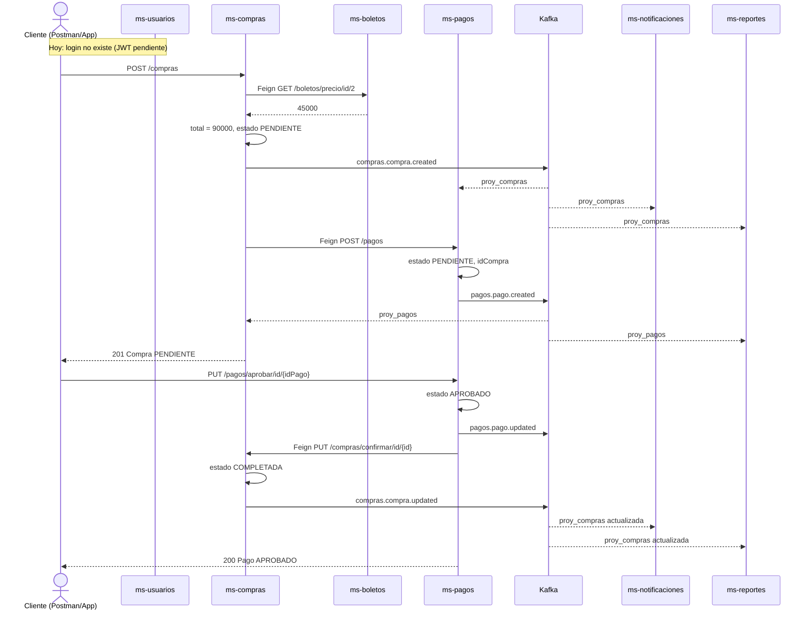

# RitmoTicket — Flujo de negocio y arquitectura (estado actual)

**Fecha:** 17 de junio de 2026  
**Alcance:** Funcionamiento del proyecto **hasta la implementación de Kafka + Feign** (sin JWT, Gateway ni Swagger).

---

## 1. Visión general

RitmoTicket es una plataforma de venta de entradas para conciertos. Está dividida en **microservicios independientes**, cada uno con **su propia base de datos PostgreSQL**. No comparten tablas; se coordinan por:

| Mecanismo | Cuándo se usa | Ejemplo |
|-----------|---------------|---------|
| **REST (HTTP)** | El cliente (Postman, app web) llama a un servicio | `POST /api/v1/compras` |
| **Feign (HTTP síncrono)** | Un MS necesita **respuesta inmediata** de otro | Compras pide precio a Boletos |
| **Kafka (eventos asíncronos)** | Un MS avisa a otros **sin esperar respuesta** | Catálogo publica evento → Boletos actualiza proyección |
| **Eureka** | Los MS se encuentran entre sí por nombre | `ms-boletos`, `ms-compras`, etc. |

**Infraestructura compartida (Docker):**

- PostgreSQL `:5433` — una BD por microservicio
- Kafka `:9092` — bus de eventos
- Kafka UI `:8080` — visualización de topics
- Eureka `:8761` — registro de servicios

---

## 2. Mapa de microservicios

| Microservicio | Puerto | Base de datos | Rol en el negocio |
|---------------|--------|---------------|-------------------|
| **eureka** | 8761 | — | Directorio: todos los MS se registran aquí |
| **ms-catalogo** | 9003 | `catalogo` | Eventos/conciertos del sistema (fuente de verdad) |
| **ms-artistas** | 9001 | `artistas` | Artistas y álbumes |
| **ms-recintos** | 9008 | `recintos` | Recintos, escenarios y sectores |
| **ms-boletos** | 9002 | `boletos` | Inventario de tickets (códigos, zonas, estados) |
| **ms-precios** | 9007 | `precios` | Tabla de precios por tipo de boleto |
| **ms-usuarios** | 9010 | `usuarios` | Clientes registrados, perfiles, direcciones |
| **ms-compras** | 9004 | `compras` | Carritos, órdenes de compra, detalle |
| **ms-pagos** | 9006 | `pagos` | Cobros, transacciones, reembolsos |
| **ms-notificaciones** | 9005 | `notificaciones` | Correos, SMS, notificaciones |
| **ms-reportes** | 9009 | `reportes` | Reportes, estadísticas, auditoría |
| **common** | — | — | Librería compartida (excepciones, eventos Kafka) |

**Pendiente (no implementado aún):** API Gateway, JWT, Swagger, despliegue en contenedores por MS.

---

## 3. Dos momentos del ciclo de vida

El sistema tiene **dos fases** distintas:

### Fase A — Preparación del concierto (back-office)

La empresa configura el evento **antes** de que un cliente compre.

### Fase B — Compra de tickets (cliente final)

Un usuario elige entradas, paga y la compra queda confirmada.

---

## 4. Fase A — Preparación (ejemplo: concierto Los Bunkers)

Orden lógico de operaciones y servicios involucrados:

```
┌─────────────┐     ┌─────────────┐     ┌─────────────┐
│ ms-artistas │     │ ms-recintos │     │ ms-catalogo │
│  (artista)  │     │  (recinto)  │     │  (evento)   │
└──────┬──────┘     └──────┬──────┘     └──────┬──────┘
       │                   │                   │
       │    referencias    │    referencias    │
       └───────────────────┴───────────────────┘
                           │
                    POST evento
                           │
                           ▼ Kafka: catalogo.evento.created
                    ┌─────────────┐
                    │ ms-boletos  │  → proy_eventos (copia local del evento)
                    └──────┬──────┘
                           │
                    POST boletos (inventario)
                           │
                           ▼ Kafka: boletos.boleto.created
         ┌─────────────────┼─────────────────┐
         ▼                 ▼                 ▼
   ms-compras         ms-precios         ms-usuarios
   proy_boletos       proy_boletos       proy_boletos
```

### Paso A.1 — Datos maestros (opcional si ya existen en seed)

| Orden | Acción | Servicio | Comunicación |
|-------|--------|----------|--------------|
| 1 | Registrar artista | ms-artistas | REST directo |
| 2 | Registrar recinto y sectores | ms-recintos | REST directo |
| 3 | Definir precios base por tipo | ms-precios | REST directo |

### Paso A.2 — Crear el evento en catálogo

| Acción | Servicio | Qué pasa |
|--------|----------|----------|
| `POST /api/v1/catalogo` | **ms-catalogo** | Guarda el concierto (nombre, fecha, artista, recinto) |
| Publicación Kafka | **ms-catalogo** → **ms-boletos** | Topic `catalogo.evento.created` |
| Consumer | **ms-boletos** | Crea fila en `proy_eventos` (proyección local) |

**Por qué Kafka y no Feign:** Boletos no necesita preguntarle a catálogo en cada request; mantiene una **copia mínima** del evento para emitir tickets sin depender de que catálogo esté online.

### Paso A.3 — Generar inventario de boletos

| Acción | Servicio | Qué pasa |
|--------|----------|----------|
| `POST /api/v1/boletos` | **ms-boletos** | Crea tickets (código, zona, estado `Disponible`) |
| Publicación Kafka | **ms-boletos** → varios | Topic `boletos.boleto.created` |
| Consumers | **ms-compras**, **ms-precios**, **ms-usuarios** | Actualizan `proy_boletos` en cada BD |

**Servicios que NO intervienen aún:** ms-pagos, ms-notificaciones, ms-reportes (hasta que haya compra/pago).

### Validaciones cruzadas (Feign, uso administrativo)

| Servicio origen | Feign hacia | Cuándo |
|-----------------|-------------|--------|
| ms-artistas | ms-catalogo | Al **eliminar** artista: verifica si tiene eventos |
| ms-recintos | ms-catalogo | Al **eliminar** recinto: verifica si tiene eventos |

Estos Feign **no participan** en la compra del cliente; son reglas de integridad para administradores.

---

## 5. Fase B — Compra real de tickets (escenario completo)

**Personaje:** Carlos (usuario id `7`)  
**Objetivo:** 2 entradas Cancha General para Los Bunkers (boleto id `2`, $45.000 c/u)  
**Total esperado:** $90.000  
**Método de pago:** WebPay

### Diagrama de secuencia (flujo principal)



---

### Paso B.1 — Usuario (hoy: manual / seed)

| Servicio | Rol |
|----------|-----|
| **ms-usuarios** | Carlos ya existe en BD (`id_usuario = 7`) |

**Estado actual:** La compra acepta `idUsuario` en el JSON, pero **no valida** vía Feign que el usuario exista (no hay `UsuarioClient` activo). Eso es una mejora futura.

---

### Paso B.2 — Carrito (opcional)

| Acción | Servicio | Comunicación |
|--------|----------|--------------|
| `POST /api/v1/carritos/boletos/id/{idCarrito}` | **ms-compras** | REST del cliente |
| Consulta precio | **ms-compras** → **ms-boletos** | **Feign** `BoletoClient` |
| Actualiza total del carrito | **ms-compras** | Local |

El carrito es **opcional** en el flujo actual: también se puede comprar directo con `POST /compras` sin pasar por carrito.

---

### Paso B.3 — Crear la compra (núcleo del flujo)

**Request del cliente:**

```
POST http://localhost:9004/api/v1/compras
```

```json
{
  "idUsuario": 7,
  "metodoPago": "WEBPAY",
  "detalles": [
    { "idBoleto": 2, "cantidad": 2 }
  ]
}
```

**Qué hace ms-compras por dentro:**

| # | Acción | Comunicación | Resultado |
|---|--------|--------------|-----------|
| 1 | Pide precio del boleto 2 | **Feign** → ms-boletos | `45000` |
| 2 | Calcula subtotales y total | Local | `90000` |
| 3 | Guarda compra | BD `compras` | estado `PENDIENTE` |
| 4 | Publica evento | **Kafka** `compras.compra.created` | Otros MS actualizan proyección |
| 5 | Pide crear pago | **Feign** → ms-pagos | Pago `PENDIENTE` con `idCompra` |

**Microservicios tocados en este paso:**

| Servicio | Cómo participa |
|----------|----------------|
| **ms-compras** | Orquestador principal |
| **ms-boletos** | Feign: devuelve precio |
| **ms-pagos** | Feign: recibe orden de cobro |
| **ms-notificaciones** | Kafka: actualiza `proy_compras` |
| **ms-reportes** | Kafka: actualiza `proy_compras` |
| **ms-pagos** | Kafka: consumer de compra (proyección) |

**No participan aún:** ms-usuarios, ms-catalogo, ms-artistas, ms-recintos, ms-precios (salvo que ya tengan `proy_boletos` del paso A).

---

### Paso B.4 — Aprobar el pago

**Request del cliente (o pasarela WebPay simulada):**

```
PUT http://localhost:9006/api/v1/pagos/aprobar/id/{idPago}
```

**Qué hace ms-pagos:**

| # | Acción | Comunicación | Resultado |
|---|--------|--------------|-----------|
| 1 | Marca pago | BD `pagos` | estado `APROBADO` |
| 2 | Publica evento | **Kafka** `pagos.pago.updated` | proy_pagos en compras/reportes |
| 3 | Confirma compra | **Feign** → ms-compras `PUT confirmar` | Compra `COMPLETADA` |
| 4 | (en compras) Publica evento | **Kafka** `compras.compra.updated` | notificaciones/reportes |

**Microservicios tocados:**

| Servicio | Cómo participa |
|----------|----------------|
| **ms-pagos** | Aprueba cobro y llama a compras |
| **ms-compras** | Feign: confirma compra + Kafka updated |
| **ms-notificaciones** | Kafka: `proy_compras` con estado actualizado |
| **ms-reportes** | Kafka: `proy_compras` y `proy_pagos` |

---

### Paso B.5 — Notificación al cliente (estado actual vs ideal)

| Aspecto | Estado actual | Ideal futuro |
|---------|---------------|--------------|
| Datos de compra en notificaciones | ✅ vía Kafka → `proy_compras` | — |
| Envío automático de email/SMS | ❌ No hay consumer que dispare correo | Servicio escucha Kafka y envía |
| ms-notificaciones | CRUD manual de notificaciones | Automatizar tras `compra.updated` |

Hoy **ms-notificaciones** recibe la proyección pero **no envía** correo automáticamente al confirmar la compra.

---

### Paso B.6 — Reportes y estadísticas

| Servicio | Rol actual |
|----------|------------|
| **ms-reportes** | Recibe `proy_compras` y `proy_pagos` por Kafka |
| Generación automática de reporte | ❌ No disparada por eventos; CRUD manual |

Los datos están **listos localmente** para reportes; falta la lógica de negocio que genere PDF/estadísticas al cerrar una venta.

---

### Paso B.7 — Cambio de estado del boleto (parcial)

Cuando un boleto pasa de `Disponible` → `Reservado` / `Vendido`:

| Acción | Servicio | Comunicación |
|--------|----------|--------------|
| `PUT /api/v1/boletos/id/{id}` | **ms-boletos** | REST |
| Publicación | **Kafka** `boletos.boleto.updated` | |
| Consumers | ms-compras, ms-precios, ms-usuarios | Actualizan `proy_boletos.estado` |

**Estado actual:** Esto **no se ejecuta automáticamente** al confirmar la compra. Habría que llamar manualmente o implementar un consumer/listener que marque boletos vendidos (mejora futura).

---

## 6. Matriz de comunicaciones (resumen)

### Feign (HTTP síncrono — “necesito respuesta ahora”)

| Origen | Destino | Endpoint | Cuándo |
|--------|---------|----------|--------|
| ms-compras | ms-boletos | `GET /boletos/precio/id/{id}` | Calcular total de compra o carrito |
| ms-compras | ms-pagos | `POST /pagos` | Tras crear compra |
| ms-pagos | ms-compras | `PUT /compras/confirmar/id/{id}` | Tras aprobar pago |
| ms-artistas | ms-catalogo | `GET .../artistas/existe/...` | Validar antes de eliminar artista |
| ms-recintos | ms-catalogo | `GET .../recintos/existe/...` | Validar antes de eliminar recinto |

### Kafka (asíncrono — “aviso a quien le interese”)

| Topic | Productor | Consumidores |
|-------|-----------|--------------|
| `catalogo.evento.created` | ms-catalogo | ms-boletos |
| `catalogo.evento.updated` | ms-catalogo | ms-boletos |
| `catalogo.evento.deleted` | ms-catalogo | ms-boletos |
| `boletos.boleto.created` | ms-boletos | ms-compras, ms-precios, ms-usuarios |
| `boletos.boleto.updated` | ms-boletos | ms-compras, ms-precios, ms-usuarios |
| `compras.compra.created` | ms-compras | ms-pagos, ms-notificaciones, ms-reportes |
| `compras.compra.updated` | ms-compras | ms-pagos, ms-notificaciones, ms-reportes |
| `pagos.pago.created` | ms-pagos | ms-compras, ms-reportes |
| `pagos.pago.updated` | ms-pagos | ms-compras, ms-reportes |

### Sin comunicación directa en la compra

Estos servicios existen y tienen API propia, pero **no se invocan** en el flujo automático de compra actual:

| Servicio | Por qué no interviene (aún) |
|----------|----------------------------|
| ms-usuarios | No hay Feign de validación en compra |
| ms-catalogo | Solo vía Kafka en fase A (eventos) |
| ms-artistas / ms-recintos | Solo administración |
| ms-precios | Solo proyección Kafka de boletos |
| ms-notificaciones | Recibe datos pero no envía automáticamente |

---

## 7. Tablas de proyección (`proy_*`)

Cada microservicio guarda **solo una copia mínima** de datos de otros dominios:

| Servicio | Tabla local | Datos que replica | Fuente del evento |
|----------|-------------|-------------------|-------------------|
| ms-boletos | `proy_eventos` | id, nombre, fecha evento | catalogo.evento.* |
| ms-compras | `proy_boletos` | id, código, estado boleto | boletos.boleto.* |
| ms-compras | `proy_pagos` | id, monto, estado pago | pagos.pago.* |
| ms-pagos | `proy_compras` | id, total, estado compra | compras.compra.* |
| ms-notificaciones | `proy_compras` | id, total, estado | compras.compra.* |
| ms-reportes | `proy_compras`, `proy_pagos` | totales y estados | compras.* / pagos.* |
| ms-precios | `proy_boletos` | inventario local | boletos.boleto.* |
| ms-usuarios | `proy_boletos` | inventario local | boletos.boleto.* |

**Idea clave:** Evitar joins entre bases de datos. Cada MS consulta su propia proyección.

---

## 8. Orden cronológico completo (compra de concierto)

Lista única desde cero hasta ticket “vendido” en el **estado actual del código**:

| # | Fase | Acción | Servicio(s) | Tipo comunicación |
|---|------|--------|-------------|-------------------|
| 1 | Prep | Crear artista | ms-artistas | REST |
| 2 | Prep | Crear recinto | ms-recintos | REST |
| 3 | Prep | Crear evento | ms-catalogo | REST + Kafka → boletos |
| 4 | Prep | Emitir boletos | ms-boletos | REST + Kafka → compras, precios, usuarios |
| 5 | Prep | (Opcional) Precios | ms-precios | REST / proyección Kafka |
| 6 | Venta | Usuario registrado | ms-usuarios | REST (manual hoy) |
| 7 | Venta | (Opcional) Agregar al carrito | ms-compras + ms-boletos | REST + Feign |
| 8 | Venta | **Crear compra** | ms-compras + ms-boletos + ms-pagos | REST + Feign + Kafka |
| 9 | Venta | **Aprobar pago** | ms-pagos + ms-compras | REST + Feign + Kafka |
| 10 | Venta | (Manual) Marcar boleto vendido | ms-boletos | REST + Kafka |
| 11 | Post | (Manual) Crear notificación | ms-notificaciones | REST |
| 12 | Post | (Manual) Generar reporte | ms-reportes | REST |

Los pasos 10–12 son **mejoras pendientes** para un flujo 100 % automático.

---

## 9. Cómo entraría el cliente en producción (futuro)

Hoy Postman llama **directo** a cada puerto (`9004`, `9006`, etc.). En producción el diseño previsto es:

```
Cliente → API Gateway (JWT) → Eureka → Microservicio
```

**No implementado aún:** Gateway, login JWT, Swagger unificado.

---

## 10. Checklist: qué está listo vs pendiente

| Capacidad | Estado |
|-----------|--------|
| Crear evento y proyectar en boletos | ✅ |
| Inventario de boletos y proyección | ✅ |
| Compra con precio vía Feign | ✅ |
| Pago automático al comprar vía Feign | ✅ |
| Confirmación de compra al aprobar pago | ✅ |
| Proyecciones Kafka en pagos/notificaciones/reportes | ✅ |
| Marcar boleto vendido al confirmar compra | ❌ |
| Email automático al cliente | ❌ |
| Reporte automático de venta | ❌ |
| Validar usuario en compra (Feign) | ❌ |
| Login / JWT | ❌ |
| API Gateway | ❌ |
| Swagger / HATEOAS | ❌ |

---

## 11. Ejemplo numérico rápido (Carlos compra 2 tickets)

```
1. POST catalogo     → evento id=15 "Los Bunkers"
2. Kafka             → boletos.proy_eventos
3. POST boletos      → boleto id=20, zona Cancha, $45.000, Disponible
4. Kafka             → proy_boletos en compras/precios/usuarios
5. POST compras      → compra id=8, total $90.000, PENDIENTE
   ├─ Feign boletos  → precio 45000
   ├─ Feign pagos    → pago id=6, PENDIENTE, idCompra=8
   └─ Kafka          → notificaciones/reportes/pagos (proy_compras)
6. PUT pagos/aprobar → pago APROBADO
   ├─ Feign compras  → compra COMPLETADA
   └─ Kafka          → compras.compra.updated, pagos.pago.updated
7. GET compras       → id=8, estado COMPLETADA
```

---

## 12. Documentos relacionados

- [KAFKA-IMPLEMENTACION.md](./KAFKA-IMPLEMENTACION.md) — Detalle técnico de eventos Kafka
- Pruebas Postman — flujos descritos en conversación de desarrollo

---

*Documento generado para describir el funcionamiento de RitmoTicket con Kafka y Feign implementados.*
